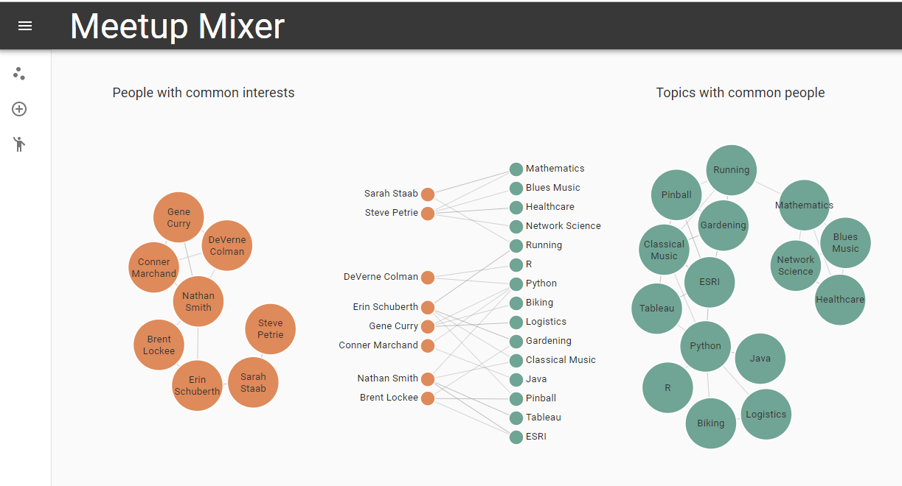

# Meetup Mixer

This project is an ice-breaker and an educational tool to teach people at a Meetup about graphs and Cypher. When new members show up to a Meetup for the first time, it can be hard to start conversations in a room full of strangers. Encourage your members to enter several interests in Meetup Mixer. The app will recommed other people at the Meetup with common interests who they can talk to. The app will also show users the Cypher that they could use to update Neo4j with their interests directly.

[](http://www.youtube.com/watch?v=rPC71lUhK_I "Hands On With The GRANDstack Starter")

## Quickstart

### Neo4j

Start by setting up a [Neo4j Sandbox](http://neo4j.com/sandbox). Choose to launch a Neo4j 3.4 sandbox. This will give you an empty Neo4j hosted in the cloud. Your sandbox will expire within a few days, so don't do this too far ahead of your Meetup. You can sign back in to Neo4j to extend it if you need to. When your sandbox is ready, click on details and note the IP Address and Bolt Port.

### OneGraph

OneGraph is a service that makes it easy to query many social and business sites from a single GraphQL endpoint. We'll use it to allow your users to sign in with Meetup. You could easily extend the application to support other authentication methods.

Visit [OneGraph.com](http://onegraph.com) and sign up for a free account. Create a new app and call it Meetup-Mixer. If you will be running Meetup Mixer on a server instead of localhost, add the domain or IP address of your server in the CORS Origins section. Note the AppID of the app you created.

### Server Prep
This app is built from the [GRANDstack](https://github.com/grand-stack/grand-stack-starter) (GraphQL, React, Apollo, Neo4j Database) starter project. You will need some React infrastructure on your server to run Meetup Mixer if you don't already have it installed.

FIrst, install [NodeJS](https://nodejs.org/en/download/) according to the instructions for your system.

Next, install [Yarn](https://yarnpkg.com/lang/en/docs/install/) according to the instructions for your system.

Now transfer the contents of this repository to your server.

### [`/api`](./api)

There are two components to the starter, the UI application (a React app) and the API app (GraphQL server). They both need to be running for your application to work. First, we'll set up the API app.

Edit /api/.env.

Change the NEO4j_URI to match the IP address and Bolt port of your Neo4j sandbox.

Change the NEO4J_PASSWPRD to the password for your server.

*Install dependencies and start API server*
```
cd ./api
yarn; yarn start
```

If you are running locally on Windows, instead of the command above, you might need to run 

```
yarn; yarn start-dev
``` 


You should now be able to see the GraphQL Playground at (http://localhost:40001/graphql)

### [`/ui`](./ui)

Now that you have started the GraphQL server, you will configure the UI application.

Edit /api/.env.

Change REACT_APP_ONEGRAPH_APP_ID to your OneGraph app id.

The GraphQL API is already running in the foreground of your terminal session. In another terminal session start the UI development server:

*Start UI server*
```
cd ./ui
yarn; yarn start
```



See [the project releases](https://github.com/grand-stack/grand-stack-starter/releases) for the changelog.


